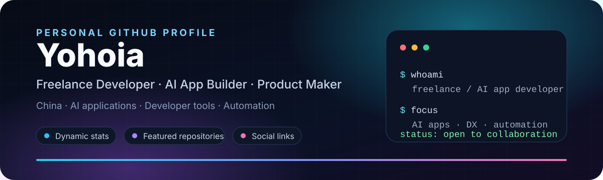

**👋 你好，我是 Yohoia**  
一名在中国的自由职业开发者与 AI 应用开发者。我关注 **AI 应用、开发者工具、自动化工作流和产品化落地**，喜欢把一个想法推进成界面清晰、数据可靠、可以持续迭代的产品。

## 🧭 个人档案

| 主题 | 当前状态 |
| --- | --- |
| 🎯 定位 | 自由职业开发者 · AI 应用开发者 · Product Maker |
| 📍 地点 | 中国 |
| 🔭 正在做 | `DiDa-todo`：任务、日程、专注与成长反馈一体的双语工作台；`yoho-get-design`：从网站提取设计规范与组件规则的 AI 工作流 |
| 🌱 持续探索 | Agentic AI 工作流、设计系统分析、自动化效率工具、独立产品交付 |
| 💡 兴趣 | AI 应用、开发者体验、自由职业产品、界面与信息设计 |
| 🤝 合作 | 自由职业开发、AI 应用原型、自动化工作流、产品共创 |
| ⚡ 工作方式 | 先定义清晰场景，再交付可运行版本，持续用反馈和数据迭代 |

## 📊 动态 GitHub 数据

这些卡片由第三方服务按 GitHub 公开数据生成，不需要手动维护：

| GitHub Stats | Repositories by Language |
| --- | --- |
|  |  |

| Most Commit Language | Profile Summary |
| --- | --- |
|  |  |

| Contribution Streak | Contribution Overview |
| --- | --- |
|  |  |

## 🚀 精选仓库

| Repository | 它解决什么问题 | 技术与信号 |
| --- | --- | --- |
| [**DiDa-todo**](https://github.com/Yohoia/DiDa-todo) · [Live Demo](https://todo.yohoia.cn) | 一个以任务为核心的双语 Web 工作台，串联收集整理、日程安排、AI 当日整理、专注计时、提醒和成长统计；面向希望减少工具切换、专注执行的人。 |      |
| [**yoho-get-design**](https://github.com/Yohoia/yoho-get-design) | 输入公开网站 URL，自动采样页面、样式与响应式行为，提取设计 token、组件规则和证据，生成可追溯的 `DESIGN.md` 与可视化预览；适合设计系统分析和前端重构前的资料整理。 |      |
| [**blog / ByteSize**](https://github.com/Yohoia/blog) | 全栈个人博客系统，包含前台展示、后台管理、文章、笔记、相册与友链模块，用于持续发布内容和沉淀个人作品。 |       |

## 🚦 最近 GitHub 动态

这个区块由本仓库的 GitHub Actions 定时更新，只展示公开的 issue、PR、release 和评论动态。

<!--START_SECTION:activity-->
- 🔄 Workflow 首次运行后，这里会自动替换成 Yohoia 的最近 GitHub 活动。
<!--END_SECTION:activity-->

## 🧰 技术栈与工具

| Languages & Frameworks | Engineering & Operations | Product & Collaboration |
| --- | --- | --- |
|       |       |      |

## 📮 联系我

| 渠道 | 链接 / 说明 |
| --- | --- |
| 📧 Email | [imyohoia@gmail.com](mailto:imyohoia@gmail.com) · 自由职业、项目合作或产品咨询 |
| 🐦 X | [@imYohoia](https://x.com/imYohoia) · 开发记录与碎片思考 |
| 🔴 Xiaohongshu | [Yohoia 的小红书](https://xhslink.cn/o/2uKZjCQ4rPa) · 产品演示与创作分享 |
| 📺 Bilibili | [Yohoia 的 Bilibili](https://b23.tv/cPvuHiv) · 视频教程、产品展示或开发分享 |
| 💬 QQ | [1109951287](https://wpa.qq.com/msgrd?v=3\&uin=1109951287\&site=qq\&menu=yes) · 项目沟通 |
| 🐙 GitHub | [@Yohoia](https://github.com/Yohoia) · 代码、项目与开源协作 |

---

动态卡片来自 GitHub 公开数据；最近活动由 GitHub Actions 自动刷新。README 的结构与视觉仅代表 Yohoia 的个人风格，不代表任何组织。

